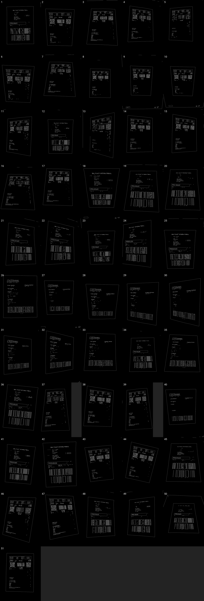
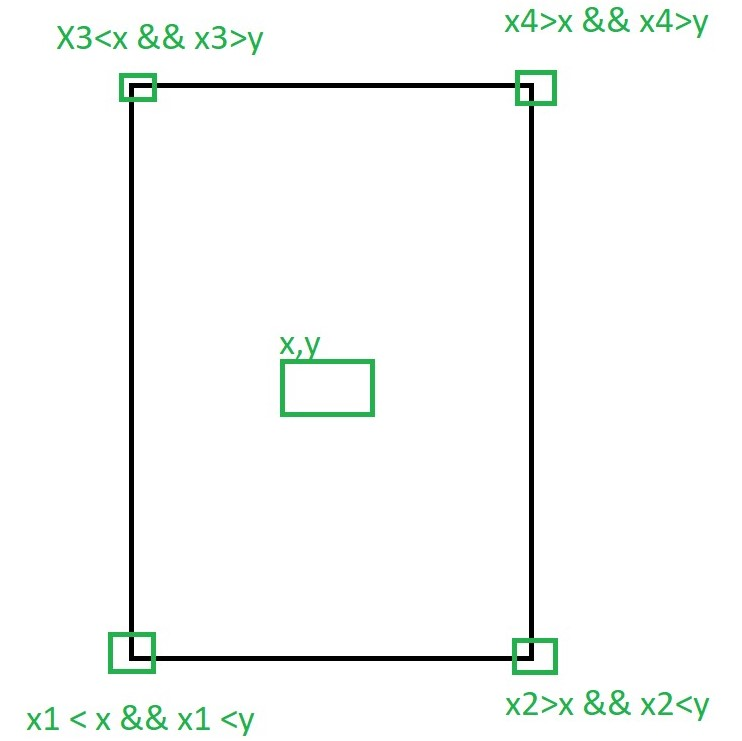

# Uniwersytet Śląski

## Wydział Nauk Ścisłych i Technicznych

### Skaner Listów Przewozowych

> Wykonał: Mateusz Klimaszewski, gr. PGK 2.

 

## Spis treści:

- Wstęp:
    - <a href="#BP">Metodyka wykonywania zdjęć</a>
- Preprocessing:
    - <a href="#PP">Preprocessing</a>
- Perspective Transform:
    - <a href="#PT">Perspective Transform</a>
- Algorytmy wykrywające charakterystyczne elementy na etykietach listów przewozowych
    - <a href="#MW">Metody wykrywania charakterystycznych elementów</a>
>Projekt został wykonany w języku Java oraz przy wykorzystaniu dodatkowych bibliotek:
> * OpenCV - biblioteka do przetwarzania obrazów
> * ZXing - biblioteka do wykrywania i dekodowania kodów kreskowych
> * Tess4J - biblioteka OCR

> <a href="https://github.com/m-klimaszewski/ShippingLabel">Repozytorium GitHub</a>

 

# Algorytm wykrywania etykiet listów przewozowych i tranformacji ich do przestrzeni 2D

## Metodyka wykonywania zdjęć:

> Proponowany algorytm do prawidłowego działania wymaga, aby list przewozowy był największym elementem zdjęcia oraz
> znajdował się na wyróżnającym go tle. Zdjęcia robione są z różnego kąta, aby sprawdzić skuteczność algorytmu.
### Zdjęcia przed preprocessingiem

 

## Preprocessing
>Zdjęcia w pierwszej fazie działania algorytmu są poddawane preprocessingu w celu zwiększenia skuteczności wykrycia 
> największej krawędzi. W tym etapie zdjęcie jest poddawane procesom takim jak:
> * Skalowanie obrazu
>   *  Wykrycie proporcji obrazu (4:3, 16:9) oraz jego orientacji (pionowa, pozioma)
>   *  Proces przeskalowania do określonych w alorytmie roździelczości. Tj.:
>     * 4:3 - 1152x864px
>     * 16:9 - 1280x720px
> * Medianblur 
> * Konwersja obrazu do sklai szarości
> * Canny detector
### Zdjęcia po preprocessingu

## Transofrmacja etykiety z przestrzeni 3d do 2d
> W tym etapie obraz jest poddawany następującym procesom:
> * Wykrycie największej możliwej krawędzi
> * Sortowanie rogów krawędzi wg. środka ciężkości największej krawędzi
>  * 
> * Wykrycie rogów oryginalnego zdjęcia i stworzenie mapy perspektywy
> * Transformacja zdjęcia z przestrzeni 3d do 2d
### Zdjęcia po transformacji

## Podsumowanie algorytmu wykrywania etykiet listów przewozowych i transformacji ich do przestrzeni 2D
### Obserwacje:
> 
> W przypadku nr. 18 oraz 24 wykryto błędnie etykietę przewozową. W przypadkach nr. 13,27,40 algorytm nie był
> w stanie wykryć w największej krawędzi znalezionej po preprocessingu wszytkich 4 jego rogów - prawdopodbnie w pewnym
> momencie krawędź etykiety została zatracona. Mogło być to spowodowane przez np. nierównomierne oświetlenie, bądź 
> słaby kontrast między krawędzią listu a jego tłem. Warto też zauważyć, że w zdjęciach nr. 37 oraz 39 zdjęcie zostało
> nieporpawnie przeskalowane.
### Wnioski:
> Sktuteczność proponowanego algorytmu, biorąc pod uwagę wyłącznie przypadki braku wykrycia etykiety na próbce 51 zdjęć 
> wynosi 90.19%. W przypadku, gdy wliczymy zdjęcia, które w sposób mocno zniekształcony zostały przeskalowane, 
> skuteczność ta spada do 86.28%
>

# Algorytmy wykrywające charakterystyczne elementy na etykietach listów przewozowych
## Metody wykrywania charakterystycznych elementów:
> W celu wykrycia użytecznych informacji na etykietach użyto następujących bibliotek:
> * ZXing - biblioteka służąca do dekodowania kodów kreskowych ze zdjęć. 
> * Tess4J - biblioteka OCR, której główną funkcją jest zaczytanie tekstu ze zdjęć. \
>
> Założeniem jest wykrycie elementów charakterystycznych takich jak:
>  * Adres email
>  * Numer telefonu  
>  * Zdekodowany kod kreskowy przy pomocy biblioteki ZXing

